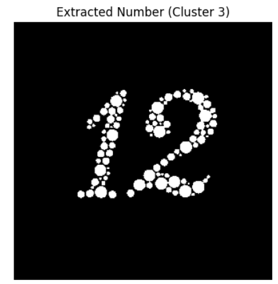
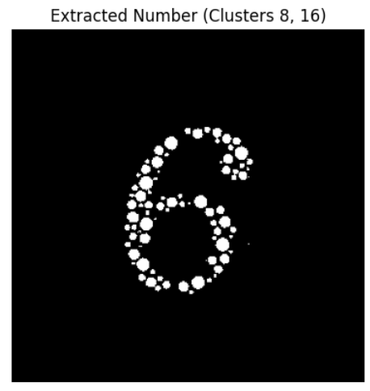
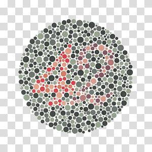
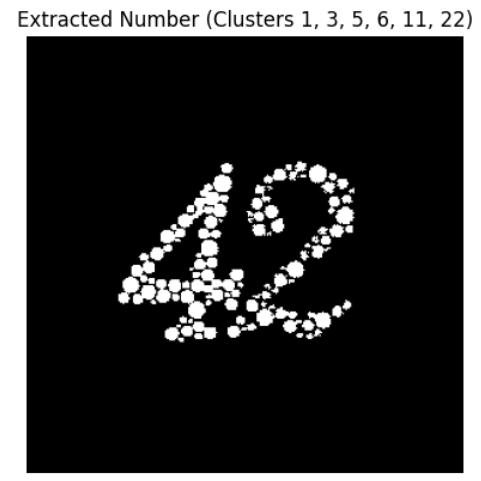
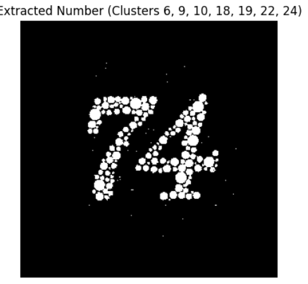

# kmeans-ishihara-extractor

A Python-based tool that applies K-Means clustering to segment and extract numbers from Ishihara color blindness test images. This is useful for analyzing how color vision deficiencies affect number visibility by isolating color regions.

---

## 🔍 Overview

This tool segments the colors of an Ishihara image using unsupervised K-means clustering. The user selects the cluster(s) that visually contain the number, and the tool creates a binary mask to isolate and extract those regions.

---

## 🧠 How It Works

1. Load the image using PIL.
2. Flatten the image into RGB pixel vectors.
3. Apply K-Means clustering to group similar colors.
4. Display each color cluster separately for inspection.
5. Ask the user to input which clusters contain the number.
6. Merge selected clusters into a binary mask and display the result.

---

## 🖼️ Example Results

Below are four example outputs showing the original Ishihara image and the extracted number:

| Example | Original Image | Extracted Number |
|--------:|----------------|------------------|
| 1 |  |  |
| 2 |    |   |
| 3 |  |  |
| 4 |  |  |
